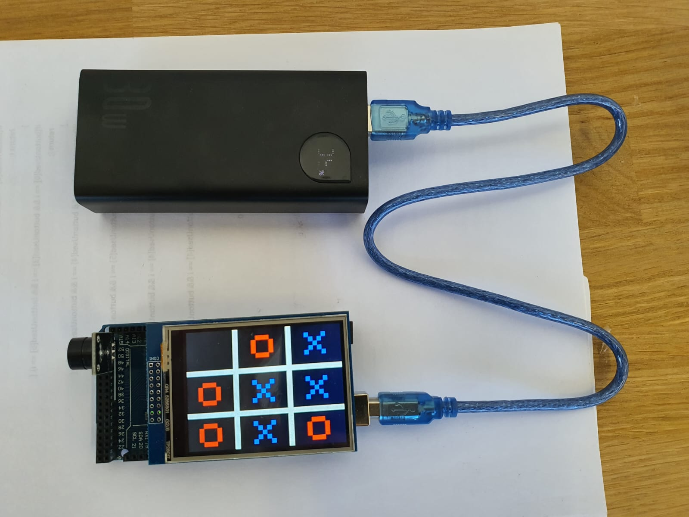
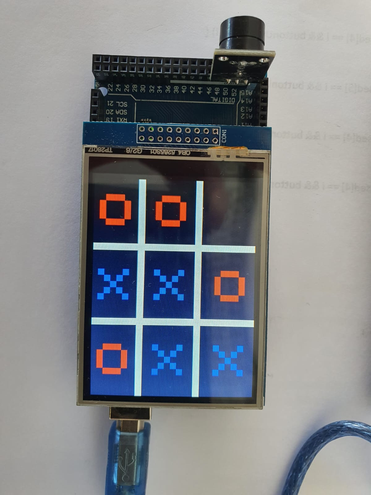

# Tic-Tac-Toe on Arduino

### A touchscreen Tic-Tac-Toe game for Arduino Mega

  

  <strong>Two players · Touchscreen · Sound effects · Arduino C++</strong>

A two-player Tic-Tac-Toe game developed as a Programming 1 Arduino project. The game runs on an **Elegoo Mega 2560** with a **2.8-inch Elegoo TFT touch shield** and a buzzer. Players tap a square to place alternating X and O marks; the display announces a win or tie and plays a short melody before returning to the start screen.

**[View the project page](https://adig741.github.io/arduino-tic-tac-toe-touchscreen/)** · **[Open the sketch](TicTacToe_Arduino/TicTacToe_Arduino.ino)**

## Project at a glance

| | |
| --- | --- |
| **Board** | Elegoo Mega 2560 / Arduino Mega 2560 |
| **Display** | Elegoo 2.8-inch TFT touch shield, configured for controller `0x9341` |
| **Input** | Resistive touch screen |
| **Output** | X/O game board, result screen, buzzer tones |
| **Buzzer signal** | Digital pin `51` |
| **Language** | Arduino C++ |

## How it works

1. The display opens on a title screen with a **Start** button.
2. Two players take turns tapping one of nine cells. X plays first, then O.
3. The program ignores occupied cells and checks all rows, columns, and diagonals after each move.
4. A winner or tie appears on screen with a melody. The next round returns to the Start screen.

The touch regions and mark positions are stored in arrays in the sketch, while `checkForWinner()` evaluates the eight possible winning lines.

## Hardware

- Elegoo Mega 2560 or compatible Arduino Mega 2560
- Elegoo 2.8-inch TFT touch shield
- Buzzer connected to digital pin `51`
- USB power source; the original build used a power bank

The sketch defines touch pins `A2`, `A3`, `8`, and `9`, and TFT control pins `A3`, `A2`, `A1`, `A0`, and `A4`. It uses fixed touch coordinates calibrated for the original shield. Other display controllers or touch orientations may require changes to the sketch.

## Upload and play

1. Install the [Arduino IDE](https://www.arduino.cc/en/software) and connect the Mega 2560.
2. Copy the three folders in [`libraries/`](libraries/)—`Elegoo_GFX`, `Elegoo_TFTLCD`, and `TouchScreen`—into your Arduino sketchbook's `libraries` directory. Restart the IDE if it was open.
3. Open [`TicTacToe_Arduino/TicTacToe_Arduino.ino`](TicTacToe_Arduino/TicTacToe_Arduino.ino). Keep [`pitches.h`](TicTacToe_Arduino/pitches.h) in the same sketch folder.
4. In **Tools → Board**, select **Arduino Mega or Mega 2560**. Select the connected port and upload.
5. Tap **Start** on the display, then take turns selecting cells.

The bundled Elegoo libraries are the copies supplied with the original hardware project. Their original notices and source headers are retained under [`libraries/`](libraries/). The game sketch was created for the original course project.

## Gallery

| Build | Game board |
| --- | --- |
|  |  |

## About this repository

This repository packages the original project as a focused GitHub portfolio entry. The public sketch preserves the gameplay and removes a broken startup color loop from the original file. The source folder also contains reference archives and a course report; those are intentionally omitted from this repository. Hardware behavior has not been retested during this packaging work.
